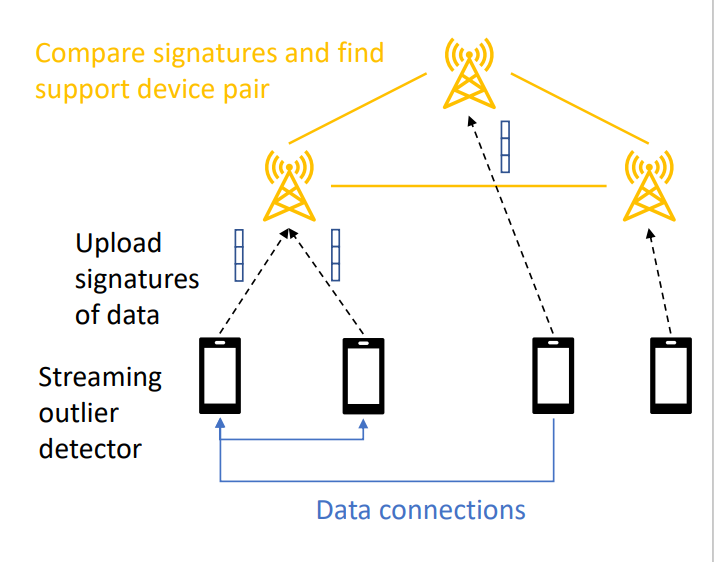
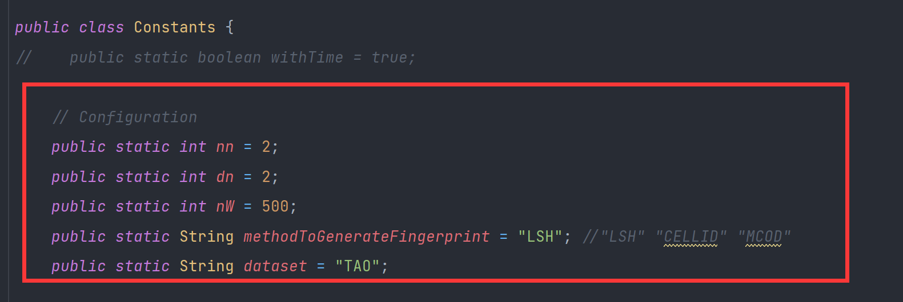
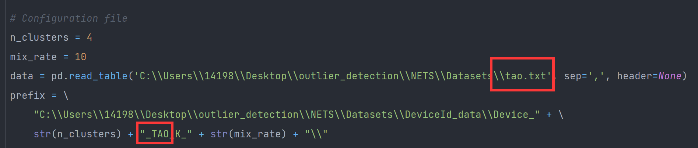
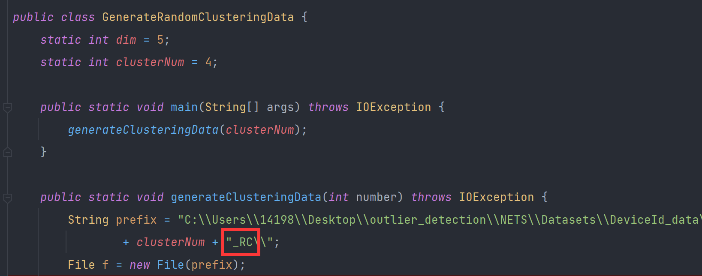

# EPOD

## 1. Architecture Introduction

- **Components**: Edge devices and Edge nodes
- **Workflow**:
  - Each device collect vector.
  - Each device generate fingerprints for each vector and find outliers
  - Upload fingerprint to the nearest node.
  - Nodes collect fingerprints from all its devices.
  - Interacts with all nodes on the network and derive the support devices for all its edge devices
  - Based on the information from edge node, each device ask its dependent devices for necessary vector
  - After receiving all vector, run the rest streaming detecting algorithm

## 2. Datasets

### #1 Original Datasets

|    Name    | # vector points | # Dim | k    | r     | s    | w      | Size   | Link                                                         |
| :--------: | :-----------: | :---: | ---- | ----- | ---- | ------ | ------ | ------------------------------------------------------------ |
| GAU(gauss) |      1M       |   1   | 50   | 0.028 | 5000 | 100000 | 7.74MB | [link](https://infolab.usc.edu/Luan/Outlier/Datasets/gaussian.txt) |
|    STK     |     1.05M     |   1   | 50   | 0.45  | 5000 | 100000 | 7.57MB | [link](https://infolab.usc.edu/Luan/Outlier/Datasets/stock.txt) |
|    TAO     |     0.58M     |   3   | 50   | 1.9   | 500  | 10000  | 10.7MB | [link](https://infolab.usc.edu/Luan/Outlier/Datasets/tao.txt) |
|    HPC     |      1M       |   7   | 50   | 6.5   | 5000 | 100000 | 28.4MB | [link](https://infolab.usc.edu/Luan/Outlier/Datasets/household2.txt) |
|    GAS     |     0.93M     |  10   | 50   | 2.75  | 5000 | 100000 | 70.7MB | [link](http://archive.ics.uci.edu/ml/machine-learning-databases/00362/HT_Sensor_UCIsubmission.zip) |
|     EM     |      1M       |  16   | 50   | 115   | 5000 | 100000 | 119MB  | [link](https://infolab.usc.edu/Luan/Outlier/Datasets/ethylene.txt) |
|     FC     |      1M       |  55   | 50   | 525   | 500  | 10000  | 72.2MB | [link](https://infolab.usc.edu/Luan/Outlier/Datasets/fc.vector) |

### #2 Extreme cases

- Cluster the datasets, and assign the different clusters to different devices (case 1)

- Cluster the datasets, and distribute the same cluster to different devices (case 2)

### #3 Normal cases

- Cluster the datasets, and mix a% vector of each cluster then assign the different clusters to different devices

- Expected result:

  - No transfer between devices in case 1

  - All devices exchange vector in case 2

  - Other cases lie in between

### #4 Dataset Path

original datasets: \NETS\Datasets

vector with device ID: \NETS\Datasets\DeviceId _data

vector with timestamp: \NETS\Datasets\Timestamp_data

## 3. How to run

注意：若每次重新准备数据，需要删除DeviceId _data和Timestamp_data下的文件夹

### run Original Datasets

- 修改 **NETS\src\utils\Constants.java**的参数

- 运行 **\utils\PrepareDatasets.java** (for the first time only)
- 运行 **\test\testNetwork.java**

### run K_means dataset and Random Data(self-generated clustering vector)

- 生成k_means的datasets：

  - \utils\k_means_clustering.py：修改下图参数跑，每次跑要删除之前的目录不然会报错

    

- 生成random cluster vector
  - utils\GenerateRandomClusteringData.java 修改参数生成特定的cluster
  - 现在统一命名成RC，后期可根据需要修改
  - constants.java 中的参数也要对应修改

- 接着运行run Original Datasets下的指令

## 4 NETs 需要确认的参数

- subdim

- 每个维度的最大值最小值 this.maxValues, this.minValues

  - random cluster需要运行 utils\decideMaxMin.java，再修改NewNETS中的值

- 维度的优先级：this.priorityList

  
